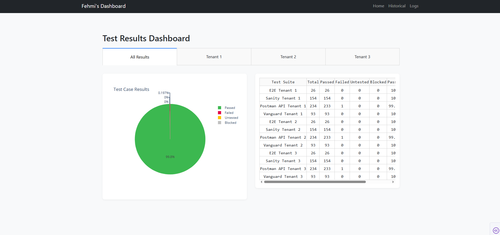
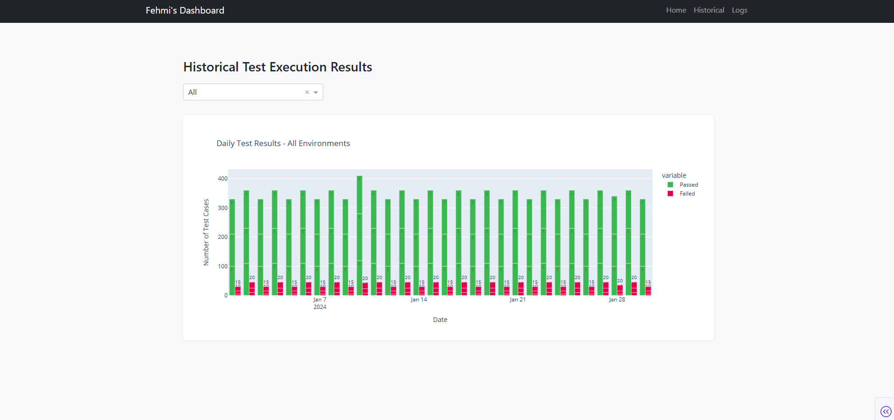

# Test Results Dashboard

# A Dash-based web application for visualizing test results across multiple tenants.

## Features

- Home page with test results summary and pie charts
- Historical test results visualization
- Test execution logs viewer
- Support for multiple tenant environments

## Installation

1. Clone the repository
2. Install dependencies:
   ```
   pip install -r requirements.txt
   ```

## Usage

Run the application:
```
python app.py
```

The dashboard will be available at http://127.0.0.1:8050/

## Project Structure

- `app.py`: Main application entry point
- `pages/`: Dashboard pages (Home, Historical, Logs)
- `utils/`: Utility functions for charts and data processing
- `data/`: CSV files with test results
- `logs/`: Test execution log files
- `assets/`: CSS styles and static assets




